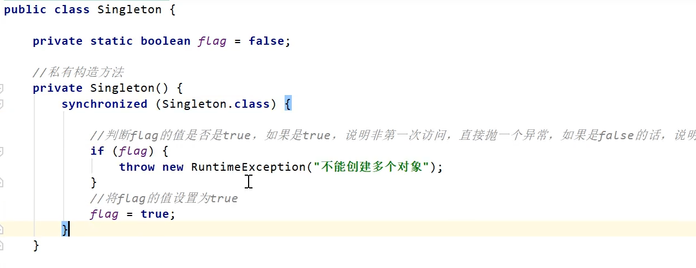

创建型模式主要的关注点是怎样创建对象，他的特点是将对象的使用和创建分离

单例模式的实现中，只有枚举式的单例不会被破坏
其他单例模式均会被 （序列化，反射）破坏
序列化：把类序列化保存到文件。然后读取文件并强制转换。可以创建出多个类 

反射：

解决序列化破坏单例模式: 

解决反射破坏单例模式：
    思路就是在私有的构造方法里面加入一些处理逻辑。比如 判断对象是否为空，不为空的话直接抛异常
